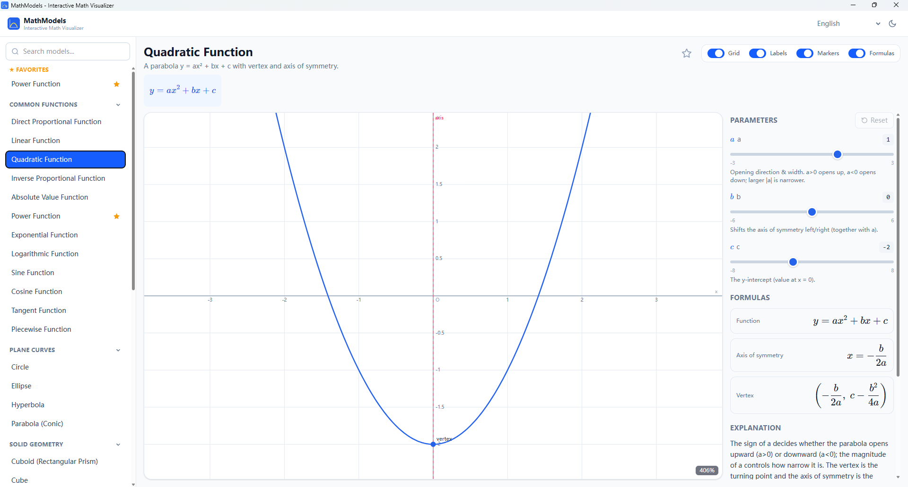
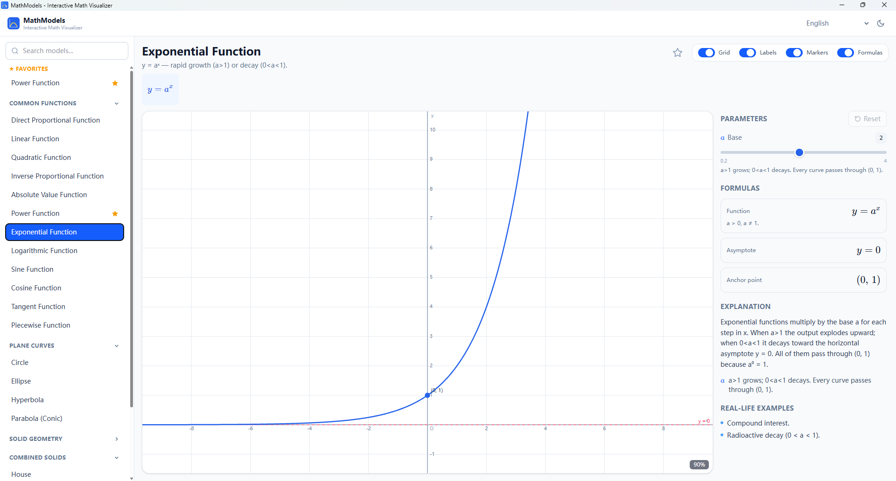
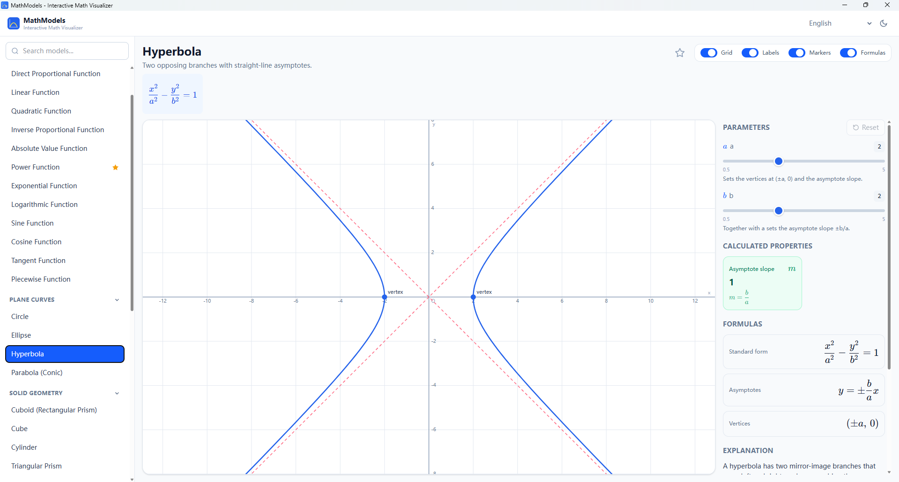
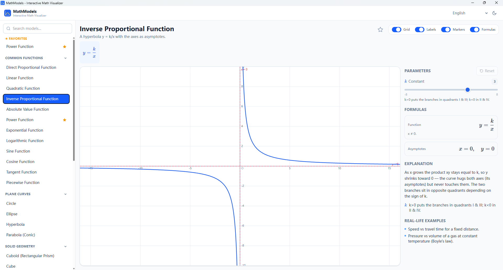
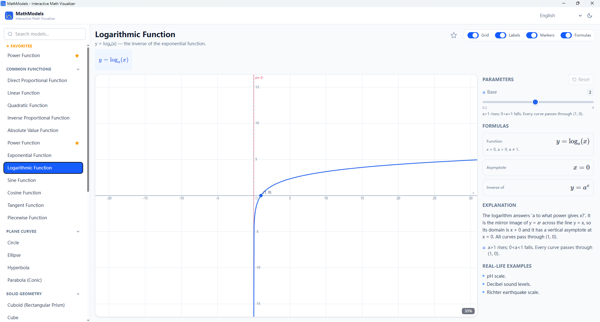
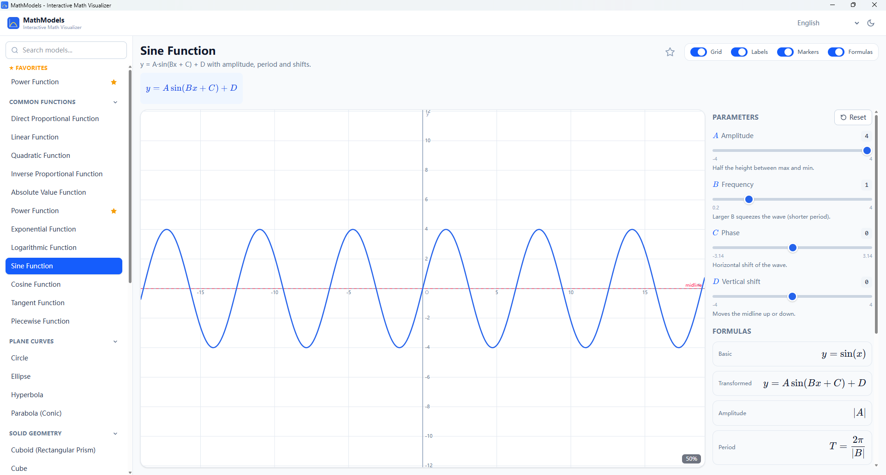
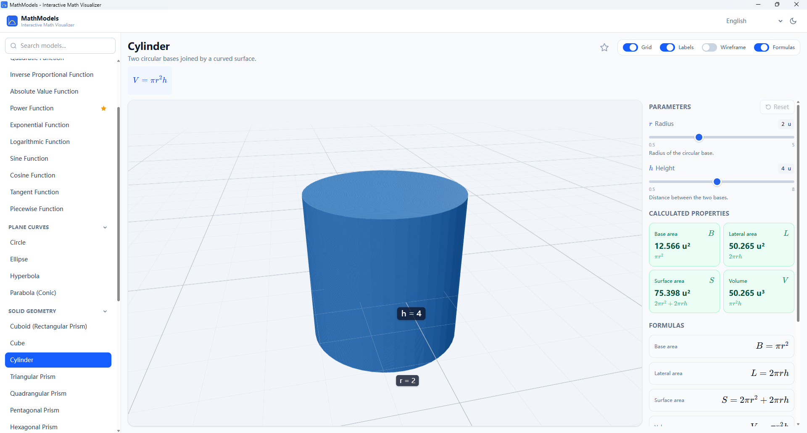
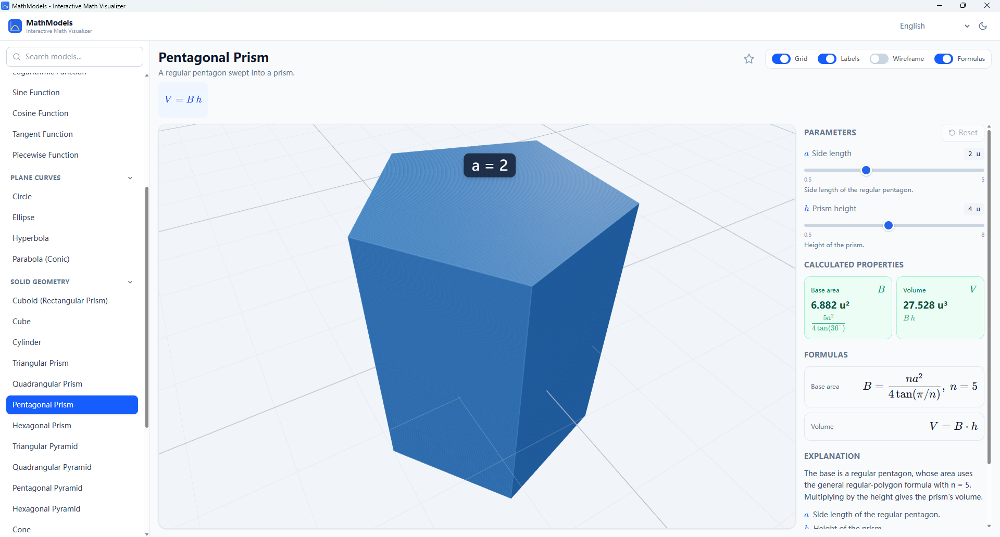
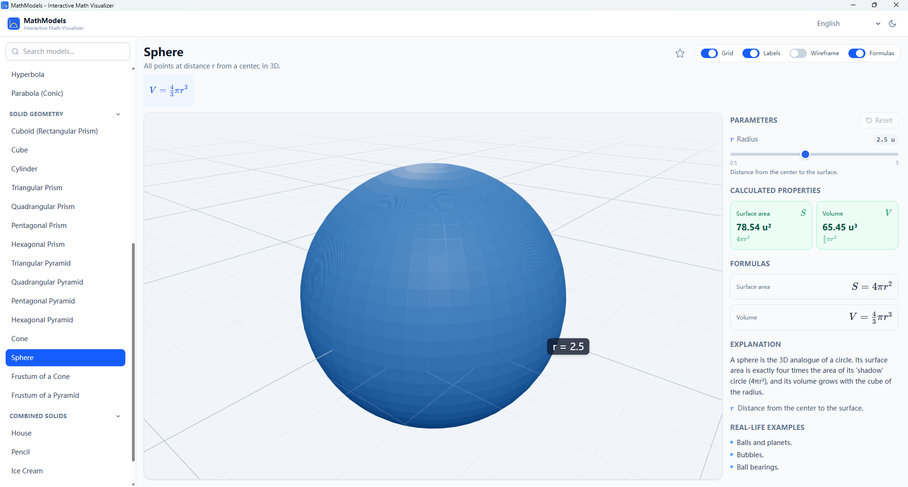
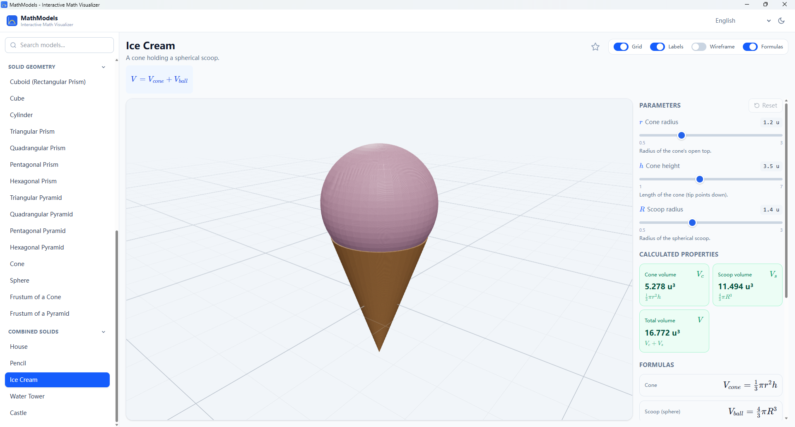

# MathModels — Interactive Math Model Visualizer

A polished, cross-platform educational app for **middle- and high-school students**
to *intuitively* explore mathematics. Unlike GeoGebra, **students never type a
formula** — every model is **predefined, categorized, and selectable**. Pick a
model and instantly see its graph or 3D shape, formulas, a plain-language
explanation, real-life examples, live parameter sliders, and computed properties
(area, surface area, volume, …).

Built from **one shared React + TypeScript codebase** that ships to **Web, Desktop
(Tauri), and Mobile (Capacitor)**, with **PWA** install + offline support.

---

## ✨ Features

- **31 + predefined models** across four categories:
  - **Common functions** — direct/inverse proportional, linear, quadratic, absolute
    value, power, exponential, logarithmic, sine, cosine, tangent, piecewise.
  - **Plane curves** — circle, ellipse, hyperbola, parabola (conic).
  - **Solid geometry** — cuboid, cube, cylinder, triangular/quadrangular/pentagonal/
    hexagonal prisms, triangular/quadrangular/pentagonal/hexagonal pyramids, cone,
    sphere, cone frustum, pyramid frustum.
  - **Combined solids** — house, pencil, ice cream, water tower, castle.
- **Data-driven registry** — models are plain data objects; the UI renders them
  generically. Adding a model is a data-only change (see below).
- **2D plotting** (responsive SVG) with grid, axes, labels, smooth curves,
  asymptotes, markers (intercepts, vertex, center, foci), and correct handling of
  domains and discontinuities (tan, 1/x, log never connect across breaks).
- **3D rendering** (Three.js + React Three Fiber) with orbit/zoom/pan, clean
  lighting, optional wireframe edges and dimension labels.
- **Real-time updates** — moving a slider instantly updates graph, 3D model,
  formulas, and computed properties.
- **Responsive layout** — desktop split-screen; mobile-first tabbed detail view
  with touch-friendly sliders and gestures.
- **Light / dark mode**, **favorites**, **last-selected memory**, KaTeX formulas.
- **PWA** — installable, offline caching of static model data.
- **Error boundaries** isolate the 2D/3D viewers so a render error never blanks
  the app.

---

## 🚀 Quick start (Web)

```bash
npm install
npm run dev        # http://localhost:5173
```

Other scripts:

```bash
npm run build      # type-check (tsc --noEmit) + production build to dist/
npm run preview    # preview the production build locally
npm run typecheck  # type-check only
```

> Requirements: **Node 18+** (developed on Node 22). No backend — everything runs
> client-side.

---

## 🧱 Architecture

A single Vite app with a clearly layered `src/` so the core logic is reusable
across all three platforms (the "packages" boundaries from the brief are mapped to
folders to keep the project runnable as one app):

```
math-model-app/
├─ index.html
├─ vite.config.ts            # React + Tailwind v4 + PWA + vendor chunking
├─ capacitor.config.ts       # mobile packaging config
├─ src-tauri/                # desktop packaging (Rust/Tauri v2)
└─ src/
   ├─ App.tsx  main.tsx
   ├─ types/model.ts         # MathModel schema + render configs  (the contract)
   ├─ models/                # the REGISTRY (data only)
   │   ├─ functionModels.ts  planeCurveModels.ts
   │   ├─ solidGeometryModels.ts  combinedSolidModels.ts
   │   └─ index.ts           # categories, search, lookup
   ├─ math/                  # formulas, geometry, graph & conic utilities
   ├─ hooks/                 # responsive layout, parameters, theme, favorites
   ├─ utils/                 # number/formula formatting, defineModel()
   └─ components/
       ├─ layout/   AppLayout · Sidebar · MobileModelSelector · ResponsiveModelPage
       ├─ model/    ModelViewer · ModelHeader · Parameter/Formula/Explanation/
       │            Example/Properties panels · ViewSettingsBar
       ├─ controls/ ParameterSlider · ToggleControl · ResetButton
       ├─ graph2d/  TwoDGraphViewer · FunctionGraph · CoordinateGrid ·
       │            AsymptoteLayer · MarkerLayer · projection
       ├─ graph3d/  ThreeDModelViewer · SolidScene · SolidControls ·
       │            DimensionLabels · solidGeometry
       └─ common/   Katex · ErrorBoundary · ViewSettings (context)
```

**Why data-driven?** Every model conforms to `MathModel` (see `src/types/model.ts`).
2D models supply a `plot2d` config (functions returning curves/asymptotes/markers);
3D models supply a `solid3d.build()` returning primitive `parts` (`box`,
`cylinder`, `sphere`, `prism`, `pyramid`). The viewers consume these generically,
so no model is ever hard-coded into a component.

---

## ➕ Adding a new math model

1. Open the matching file in `src/models/` (or create a new one and export it from
   `src/models/index.ts`).
2. Add an entry using the `defineModel()` helper (it fills `defaultValues` and
   `parameterExplanations` from your parameters automatically).

**2D example:**

```ts
defineModel({
  id: "my-curve",
  category: "functions",
  name: "My Curve",
  description: "Short blurb.",
  visualizationType: "2d-function",
  formula: "y = a x^2",
  formulas: [{ label: "Function", latex: "y = a x^2" }],
  parameters: [
    { id: "a", label: "a", symbol: "a", defaultValue: 1, min: -3, max: 3, step: 0.1,
      explanation: "Controls width." },
  ],
  explanation: "Why it looks the way it does.",
  examples: ["A real-world use."],
  plot2d: {
    defaultView: { xMin: -10, xMax: 10, yMin: -10, yMax: 10 },
    curves: (p) => functionCurves((x) => p.a * x * x, -10, 10),
  },
});
```

**3D example** (uses the `box` / `cylinder` / `sphere` / `prism` / `pyramid`
primitives, plus optional `properties` for live area/volume):

```ts
defineModel({
  id: "my-solid",
  category: "solids",
  name: "My Solid",
  description: "…",
  visualizationType: "3d-solid",
  formula: "V = a^3",
  formulas: [{ label: "Volume", latex: "V = a^3" }],
  parameters: [{ id: "a", label: "Edge", symbol: "a", defaultValue: 3, min: 1, max: 6, step: 0.1 }],
  explanation: "…",
  examples: ["…"],
  properties: [{ label: "Volume", symbol: "V", unit: "u³", latex: "a^3", compute: (p) => p.a ** 3 }],
  solid3d: { build: (p) => ({ parts: [{ type: "box", size: [p.a, p.a, p.a] }] }) },
});
```

That's it — the model appears in the sidebar/search and renders automatically.

---

## 🖥️ Desktop app (Tauri)

Prereqs: **Rust** (https://rustup.rs) and the Tauri system dependencies for your
OS (see https://tauri.app/start/prerequisites/).

```bash
# generate icons once (from any square PNG) — required for builds, not for dev:
npm run tauri icon ./public/icon-source.png

npm run tauri:dev      # run the app in a native window (hot reload)
npm run tauri:build    # produce installers in src-tauri/target/release/bundle/
```

The desktop build reuses the exact same React app (`dist/`) and keeps the
split-screen layout; the window is resizable with sensible min size. Tauri config
lives in `src-tauri/tauri.conf.json`.

---

## 📱 Mobile app (Capacitor)

Prereqs: **Android Studio** (Android) and/or **Xcode** (iOS, macOS only).

```bash
# 1) add the platform packages (one-time)
npm install @capacitor/android @capacitor/ios

# 2) add native projects (one-time)
npx cap add android
npx cap add ios

# 3) build web assets + copy into native projects, then open the IDE
npm run cap:android    # = build + cap sync + open Android Studio
npm run cap:ios        # = build + cap sync + open Xcode
```

`npm run cap:sync` rebuilds the web app and syncs it whenever you change the code.
The mobile layout (tabs, large viewer, touch sliders, safe-area handling) is the
same responsive React app — no separate native code.

---

## 📦 PWA / offline

PWA support is provided by `vite-plugin-pwa` (configured in `vite.config.ts`):

- Web manifest with app name + icon, `display: standalone`.
- Auto-updating service worker that precaches the app shell and static model data
  for **offline** use.
- Installable from the browser ("Install app" / "Add to Home Screen").

Build and preview to test it:

```bash
npm run build && npm run preview
```

---

## 🛠️ Tech stack

React 19 · TypeScript (strict) · Vite 7 · Tailwind CSS v4 · KaTeX · SVG 2D
plotting · Three.js + @react-three/fiber + @react-three/drei · vite-plugin-pwa ·
Tauri v2 · Capacitor 7.

## 📄 License

MIT — use it freely for teaching and learning.

---

## Desktop Screenshots












## Mobile Screenshots

